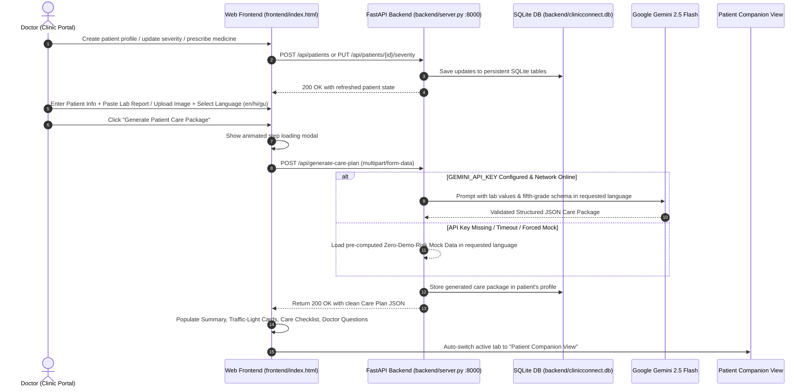

# Rocket
healthtech
# ClinicConnect - AI Healthcare Portal & Patient Companion

A production-ready full-stack healthcare application featuring dual portals (**Clinic Portal / Doctor View** and **Patient Companion / Patient View**), a **Language-Free Voice Assistant**, dynamic **Health Severity Indicators** (🟢 Green, 🟠 Orange, 🔴 Red), **Medicine Timers with Pill Pictures**, persistent **SQLite Database** (`clinicconnect.db`), and a **Google Gemini 2.5 Flash Care Plan Pipeline** with multilingual support (English, Hindi, Gujarati) and zero-demo-risk offline fallback.

---

## 📁 Clean Directory Architecture

The repository is cleanly partitioned into dedicated **`frontend/`** and **`backend/`** modules:

```text
c:\heathcare\
├── backend/                         # 🐍 Python FastAPI REST API & SQLite Engine
│   ├── server.py                    # Main FastAPI server with Gemini pipeline & SQLite DB
│   ├── mock_data.py                 # Multilingual zero-risk fallback dataset
│   ├── clinicconnect.db             # Persistent SQLite database (patients, medicines, care plans)
│   ├── requirements.txt             # Python dependencies (fastapi, uvicorn, pydantic, etc.)
│   └── run_backend.ps1              # Script to start backend on http://127.0.0.1:8000
│
├── frontend/                        # 🌐 Web UI & Client Logic
│   ├── index.html                   # Responsive HTML5 healthcare portal
│   ├── app.js                       # Frontend state, Voice AI engine & live REST API client
│   ├── styles.css                   # Custom styles, animations & traffic-light cards
│   └── start_frontend.ps1           # Optional local HTTP web server on http://localhost:8080
│
├── start_all.ps1                    # 🚀 Master 1-click launcher (starts backend + opens frontend)
├── push_to_github.ps1               # 📦 Deployment script for GitHub
└── README.md                        # Complete project documentation
```

---

## 🌟 Features & Architecture



---

## 🛠️ Backend API Specification

| Method | Endpoint | Description |
| :--- | :--- | :--- |
| `GET` | `/api/health` | Server status, Gemini model, and SQLite DB connectivity check |
| `GET` | `/api/patients` | Fetch all patient records from SQLite database |
| `POST` | `/api/patients` | Register a new patient with access code |
| `GET` | `/api/patients/{id}` | Get full patient profile, severity, and active medicines |
| `PUT` | `/api/patients/{id}/severity` | Live update severity badge (green / orange / red) |
| `POST` | `/api/patients/login` | Single-click patient access via one-time code |
| `POST` | `/api/patients/{id}/medicines` | Prescribe medicine with pill icon, timer, & voice note |
| `PATCH` | `/api/medicines/{id}/toggle-taken` | Mark medicine as taken/untaken with timestamp |
| `POST` | `/api/generate-care-plan` | Gemini 2.5 Flash empathetic lab analyzer (en/hi/gu) |

---

## 🚀 How to Run

### Option 1: 1-Click Master Launcher (Recommended)
Run in PowerShell from the project root:
```powershell
.\start_all.ps1
```
This automatically:
1. Starts the FastAPI backend on `http://127.0.0.1:8000`.
2. Connects to `backend/clinicconnect.db`.
3. Opens `frontend/index.html` in your default browser.

### Option 2: Run Backend Separately
From the project root:
```powershell
.\backend\run_backend.ps1
```
Interactive OpenAPI Swagger docs available at:
`http://127.0.0.1:8000/docs`

### Option 3: Run Frontend Separately
From the project root:
```powershell
.\frontend\start_frontend.ps1
```
Runs a local HTTP web server on `http://localhost:8080/`.

---

## 🛡️ Zero Demo Risk Offline Fallback
- If `GEMINI_API_KEY` is not present in the environment or offline, the backend instantly serves pre-computed, clinically validated care plans:
  - **Hemoglobin**: `10.1 g/dL` (`attention` / slightly low)
  - **Fasting Sugar**: `95 mg/dL` (`normal` / optimal)
  - **Total Cholesterol**: `245 mg/dL` (`borderline` / moderately elevated)
- Available in all 3 languages:
  - **English (`en`)**
  - **Hindi (`hi`)** in clean Devanagari script
  - **Gujarati (`gu`)** in clean Gujarati script
- The frontend also incorporates internal client fallbacks so the app never fails during live demos.

---

## 📦 How to Push Code to GitHub

The repository remote points to [https://github.com/aangichopra08-glitch/Rocket](https://github.com/aangichopra08-glitch/Rocket).

### Push with Personal Access Token:
In PowerShell:
```powershell
.\push_to_github.ps1 -Token "ghp_yourPersonalAccessTokenHere"
```

### Push Interactively:
```powershell
.\push_to_github.ps1
